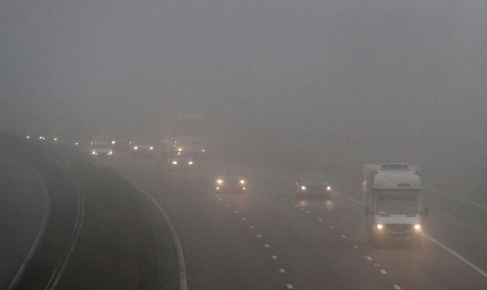
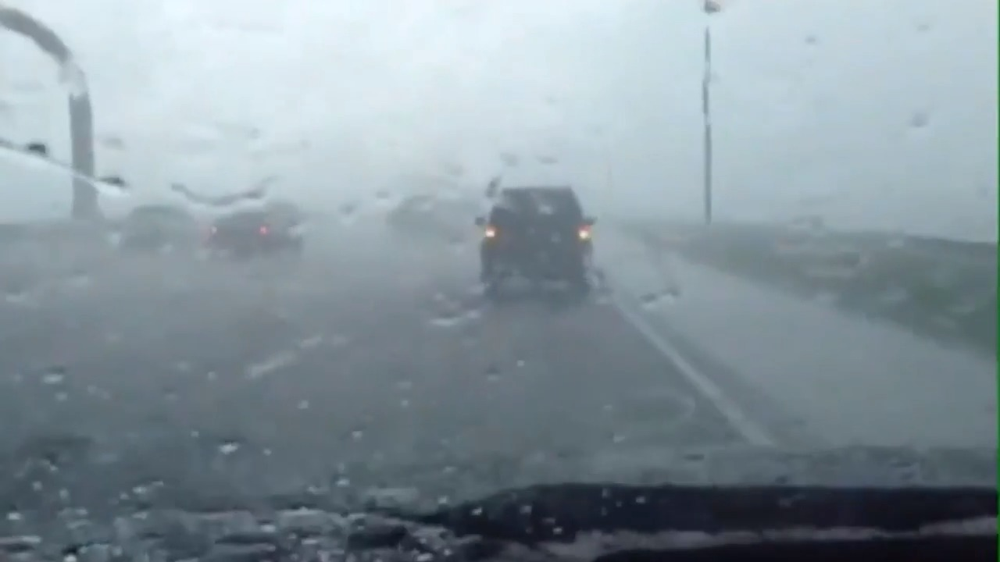

# Object Detection and Defogging Pipeline

<table style="text-align: center;">
  <tr>
    <td width="400">
        
    </td>
    <td width="600">
       This paper explores and compares the effects of various dehazing techniques on object detection in adverse weather conditions through common object detection algorithms. The aim of the paper is to develop an optimum technique capable of accurate traffic object detection in low visibility situations. On developing, this algorithm can help automated cars to drive safely in adverse weather conditions and can be used as an ADAS to further lower the risks of accidents in such situations. This paper aims to improve the performance of object detection models used in adverse conditions through implementing various dehazing techniques. The model is trained using state-of-the-art YOLO v8 architecture provided by the ultralytics. A comparative analysis between a model trained on unedited images of DAWN Dataset and de-hazed images of DAW Dataset is analyzed and studied based on various performance metrics. The results suggested (hopefully) significant increase in accuracy (mAP) of the objects being detected and classified even in foggy, sandy, rainy and conditions. This study recommends the usage of such techniques for an overall more generic and dynamic model. 
    </td>
  </tr>
</table>

## Table of Contents

1. [Project Overview](#project-overview)
2. [Scope](#scope)
3. [Features](#features)
4. [Techniques Used](#techniques-used)
5. [Libraries Used](#libraries-used)
6. [Setup & Installation](#setup--installation)
7. [Results](#results)
8. [Usage](#usage)
9. [Future Scope](#future-scope)
10. [License](#license)
11. [Conclusion](#conclusion)

## Project Overview

This project combines object detection and image defogging techniques to evaluate the effect of defogging on detection accuracy. The pipeline processes images, applies defogging algorithms, performs object detection using YOLOv8, and computes performance metrics such as precision, recall, and mAP (mean Average Precision). The results are saved in organized directories for analysis.


## Scope

The primary objective is to evaluate the effectiveness of defogging methods in enhancing object detection accuracy. The results are applicable in:

-   Autonomous vehicles operating in foggy conditions
-   Surveillance systems in adverse weather
-   Enhancing clarity in aerial and satellite imagery

## Features

-   **Image Defogging:** Processes images using techniques like CLAHE (Contrast Limited Adaptive Histogram Equalization) and Dark Channel Prior.
-   **Object Detection:** Utilizes YOLOv5 to detect objects in both original and defogged images.
-   **Metrics Evaluation:** Computes precision, recall, and mAP to assess the impact of defogging on detection performance.
-   **Automated Pipeline:** Runs end-to-end processing, from image preprocessing to results analysis.
-   **Image Saving:** Stores detected images and predictions for review.

## Techniques Used

1. **Defogging Algorithms:**
    - CLAHE
    - Dark Channel Prior
2. **Object Detection:**
    - YOLOv8
3. **Metrics Calculation:**
    - Precision, recall, and mAP to evaluate detection accuracy.
4. **Visualization:**
    - Plots performance metrics for comparative analysis.

## Libraries Used

-   `torch`: PyTorch for deep learning and YOLOv5 loading.
-   `ultralytics`: YOLOv5 integration and inference.
-   `cv2`: OpenCV for image processing.
-   `json`: Handling ground truth and prediction data.
-   `matplotlib`: Plotting evaluation metrics.
-   `os`: File and directory management.

## Setup & Installation

1. Clone the repository:
    ```bash
    git clone https://github.com/yolo-daw/yolo-daw-0.git
    ```
2. Install dependencies:
    ```bash
    pip install -r requirements.txt
    ```
3. Download the YOLOv8 model:
    ```bash
    python -m torch.hub download ultralytics/yolov8
    ```
4. Run the model:
    ```bash
    python main.py
    ```

## Results

Based on our observations, it was clear that yolo-daw performed far better than native yolo-v8 detection model. Following are the results of the model.

<table style="text-align: center;">
  <tr>
    <td><label>Input Image</label></td>
    <td><label>Yolo-v8 Output</label></td>
    <td><label>Yolo-daw Output</label></td>
  </tr>
    
  <tr>
    <td></td>
    <td></td>
    <td></td>
  </tr>
    
  <tr>
    <td></td>
    <td></td>
    <td></td>
  </tr>
  
  <tr>
    <td></td>
    <td></td>
    <td></td>
  </tr>
</table>


## Usage

1. Place test images in the `data/test/images` directory.
2. Add ground truth data in `data/test/ground_truth.json`.
3. Run the pipeline:
    ```bash
    python main.py
    ```
4. Results will be saved in the `results` directory with the following structure:
    ```
    results/
    ├── original/
    ├── defogged_clahe/
    ├── defogged_dark_channel/
    ├── detection_original/
    ├── detection_clahe/
    ├── detection_dark_channel/
    ```

## Future Scope
        
-   Adding more defogging algorithms for comparative analysis.
-   Extending the pipeline to include other object detection models.
-   Deploying a REST API for remote image processing.
-   Real-time defogging and detection.

## License

This project is licensed under the MIT License. See `LICENSE` file for details.

## Conclusion

This pipeline provides a robust framework for analyzing the impact of defogging on object detection. It simplifies the evaluation of preprocessing techniques and can be extended for real-world applications. The results demonstrate how image enhancement can improve detection accuracy under challenging conditions.
